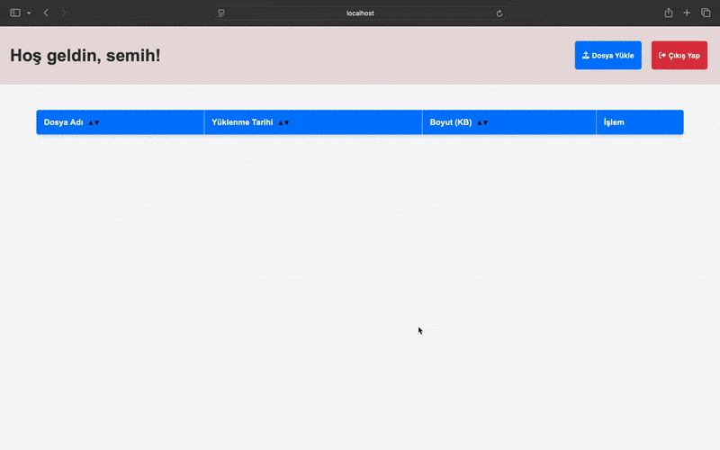

# File Upload & Management Application

A simple and modern web-based file management application where users can register, log in, upload, and manage their files.

---

## Features

- User registration and login
- Password reset
- PDF/JPG/PNG file upload
- File listing, download, and delete
- User-specific file management
- Drag-and-drop and multi-file upload support

---

## Installation

1. **Download the Project**
   - Extract all files into a folder.

2. **Requirements**
   - PHP 7.2 or higher
   - Make sure `uploads/`, `uploads.json`, and `users.json` are writable:
     ```sh
     chmod 755 uploads
     chmod 666 uploads.json users.json
     ```

3. **Start the Application**
   - Open a terminal in the project folder and run:
     ```sh
     php -S localhost:8000
     ```
   - Go to [http://localhost:8000/login_form.php](http://localhost:8000/login_form.php) in your browser.

---

## Usage

- **Register:** Create a new user account.
- **Login:** Log in with your account.
- **Upload Files:** Upload files by drag-and-drop or file selection.
- **Manage Files:** List, download, or delete your uploaded files.
- **Password Reset:** Reset your password from the login screen.

---

## Screenshot / Demo




---

## File Structure

- `dashboard.php` : Main dashboard
- `login_form.php`, `register_form.php`, `forgot_password_form.php` : Authentication screens
- `file_list.php` : File listing component
- `helpers.php` : Helper functions
- `upload_process.php` : File upload operations
- `delete_file.php` : File delete operations
- `login_process.php`, `register_process.php`, `reset_password_process.php` : Authentication processes
- `logout_process.php` : Logout process
- `uploads/` : Uploaded files directory
- `uploads.json`, `users.json` : Database files

---

## Security

- Passwords are stored hashed.
- Each user can only see and manage their own files.

---

## License

This project is for educational and personal use.

---

## Author
- Semih Gökmen